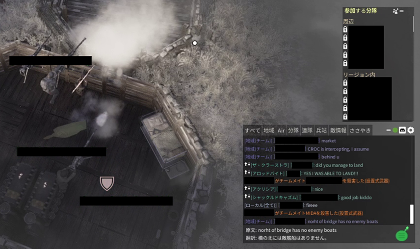

# Foxhole Chat Translator

英語・ロシア語・韓国語・中国語のチャットをリアルタイムで日本語に翻訳するMod。**ずんだもんの声で読み上げもできます。**



---

## こんな感じで動きます

```
[Squad] DontSleep_US: enemy tanks north, need AT fast
→ 「北に敵戦車。対戦車装備が至急必要」

[Logi] Иван_RU: нужны патроны на передовой
→ 「前線で弾薬が必要」

[Local] 철수_KR: 다리 폭파해야 해요
→ 「橋を爆破する必要があります」
```

翻訳はPC内のAIが処理するため、**外部サービスへの登録も課金も不要**です。

---

## 機能

| 機能 | 内容 |
|------|------|
| チャット翻訳 | 英語・ロシア語・韓国語・中国語 → 日本語をリアルタイム表示 |
| ずんだもん読み上げ | 翻訳テキストをずんだもんの声で読み上げ |
| オーバーレイ表示 | 画面右下に原文と翻訳を同時表示 |
| ワンクリックON/OFF | ラジオアイコンで即座に切り替え |

---

## ⚠️ BANリスクについて

EAC（不正行為対策）に検知されてBANされる可能性があります。現時点でBAN報告はありませんが、**自己責任でご利用ください。**

---

## 動作環境

Windows 10 / 11（64ビット）、Steam版Foxhole、空きディスク約5GB

---

## インストール

### 1. ZIPをダウンロードして解凍

**[最新版をダウンロード](https://github.com/syncsyncsynchalt/FoxholeChatTranslatorMod/releases/latest)**

### 2. インストーラーを起動

`install.ps1` を右クリック →「**PowerShell で実行**」

Foxholeのインストール先が自動検出されてインストールされます。

> **エラーが出た場合:** PowerShell を管理者として開き、以下を実行してください:
> ```
> Set-ExecutionPolicy -Scope CurrentUser RemoteSigned
> ```

### 3. Foxholeを起動

> **📥 初回起動のみ:** 翻訳AIのデータ（約3GB）が自動でダウンロードされます。準備が終わると自動で翻訳が始まります（目安：5〜15分）。

---

## 使い方

画面右下の **ラジオアイコン** をクリックするだけです。

| アイコン | 状態 |
|---------|------|
| 通常（白） | 翻訳・読み上げ ON |
| 半透明 | 翻訳・読み上げ OFF |
| 赤色 | 翻訳AIに異常あり（クリックで再起動） |

---

## 音声読み上げ（ずんだもん）

インストール時に自動でセットアップされます。約500MB〜1GBのダウンロードが発生します。

---

## アンインストール

1. Steamライブラリで Foxhole を右クリック →「プロパティ」→「ローカルファイル」→「参照」
2. `War\Binaries\Win64\` 内の以下を削除:
   - `version.dll` / `chat_translator.dll` / `config.ini`
   - `assets` フォルダ / `tools` フォルダ
